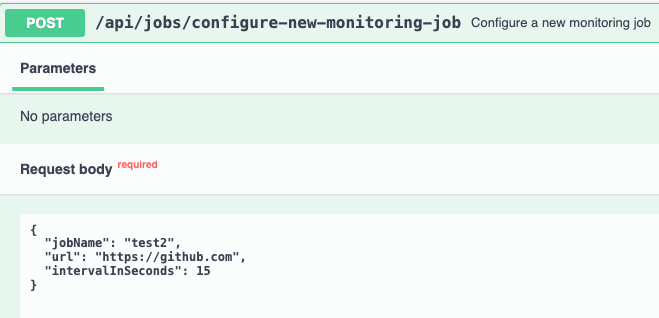
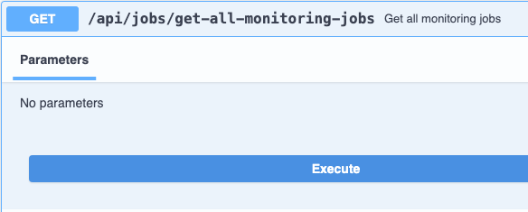
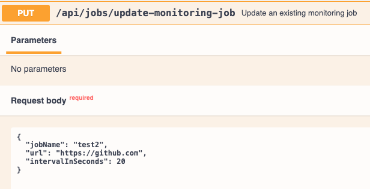
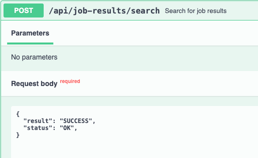
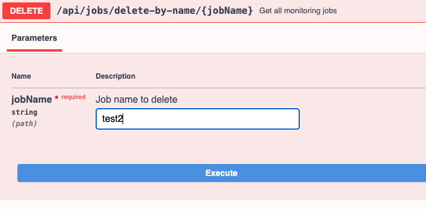

## Table of Contents

- [Introduction](#introduction)
- [Pre Requisites](#prerequisites)
- [Getting Started](#getting-started)
- [API Documentation](#documentation)
- [Usage](#usage)
- [Future Implementations](#future)
- [Blockers](#blockers)
- [Personal Considerations](#considerations)

## Introduction

This Monitoring Job API lets you create from 1 to 5 Monitoring Jobs that will run periodically based on an interval of the user's choosing.
This monitoring job will ping the specified url and store the result from it.

## Pre Requisites

- Java 21
- Postgres 14
- Docker 20.10.14 (Optional)

## Getting Started

- Clone the project to your locally and build it using gradle command at the root project level "./gradlew clean build".

- Alternatively you can run the command "./gradlew clean build -x test" to avoid having to setup the local db if you don't want to run the tests on build.
  - You can create a Postgres server locally on port 5432 and the db "codechallenge_db" with the cli command 'createdb codechallenge_db' if you want to build locally.
    This is because the integration tests run on build time and for that you need a running db instance.

- After that, you can start the project on a docker container:
  - At the project's root level, run in sequence the commands "docker-compose build" to build the image with the latest war from the previous command, and "docker-compose up" to run the service.
  
- If you setup the db locally like described on the first point, or if you already have the postgres container running, you can also run the war locally through the IDE or from running the command at root level 
'java -jar build/libs/hansecom-codechallenge-0.0.1-SNAPSHOT.war' 

## API Documentation
With the service running, access the Swagger UI at http://localhost:8080/hansecom-codechallenge/swagger-ui/index.html with a ready to use client interface for calling the APIs endpoints

## Testing
You can easily test the running API using the Swagger UI as specified above.
You can also use an API Manager like Postman, following the swagger documentation.

The project's unit and integration tests run during the application build, but you can run it at any time by using the command "./gradlew test" from the root.

## Running Scenario
- Configure 3 monitoring jobs calling the post endpoint /api/jobs/configure-new-monitoring-job with the following bodies:
  - {
    "jobName": "job 1",
    "url": "https://example.com",
    "intervalInSeconds": 10
    }
  - {
    "jobName": "job 2",
    "url": "https://hansecom.com",
    "intervalInSeconds": 15
    }
  - {
    "jobName": "job 3",
    "url": "https://example.com",
    "intervalInSeconds": 20
    }
  

- The jobs will start running once they get added (or updated)
- Check the created jobs by using the get endpoint '/api/jobs/get-all-monitoring-jobs' (you should already be able to see some results from the jobs in the response):

- Update the interval or the url on any created job by using the put endpoint '/api/jobs/update-monitoring-job': 

- Configure 3 monitoring jobs calling the post endpoint /api/jobs/configure-new-monitoring-job with the following bodies:
  - {
    "result": "SUCCESS",
    "status": "OK",
    }

- You can only create up to 5 monitor jobs so if needed, use the endpoint '/api/jobs/delete-by-name/{jobName}' to delete existing monitoring jobs:

## Bugs
- Search results endpoint worked inconsistently sometimes when searching with the time range (it was no longer detected on the latest build)

## Future Implementations

This project can be considered a proper POC, but in order for it to be used in a real production scenario it would benefit a lot from achieving these future goals: 
- Profiling (separate running context based on profile (dev, prod, test, etc)
- Security
- Caching
- Cloud Infrastructure (like exemplified in 'infrastructure/cf-template.yaml')
- CORS Restrictions
- Pipeline triggering (like exemplified in 'cicd/pipeline.yaml')

## Personal Considerations

It has been 2 years since developing with Java. For the last 2 years I've been developing entirely with Kotlin so was fun to feel the contrast between these 2 
JVM languages. I had almost forgotten what is like to have NPEs during development, Kotlin has spoiled me!
